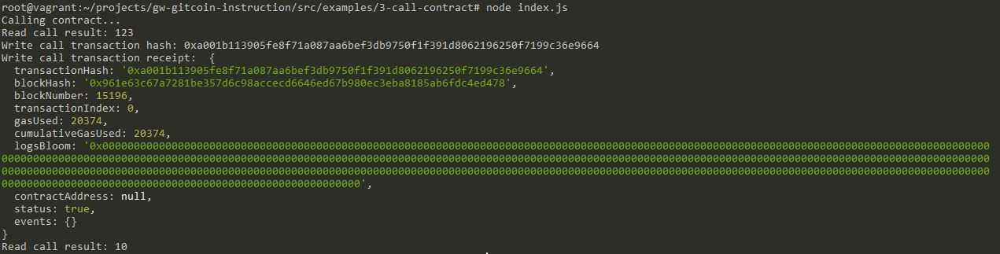

### A screenshot of the console output
   

### The transaction hash from the console output (in text format).

   0xa001b113905fe8f71a087aa6bef3db9750f1f391d8062196250f7199c36e9664

### The contract address that you called (in text format).

   `0x699f1446463AaD077E0C7a1D5759eEA78aD92a67`

### The ABI for contract you made a call on (in text format).

```
[
    {
      "inputs": [],
      "stateMutability": "payable",
      "type": "constructor"
    },
    {
      "inputs": [
        {
          "internalType": "uint256",
          "name": "x",
          "type": "uint256"
        }
      ],
      "name": "set",
      "outputs": [],
      "stateMutability": "payable",
      "type": "function"
    },
    {
      "inputs": [],
      "name": "get",
      "outputs": [
        {
          "internalType": "uint256",
          "name": "",
          "type": "uint256"
        }
      ],
      "stateMutability": "view",
      "type": "function"
    }
  ]
```
