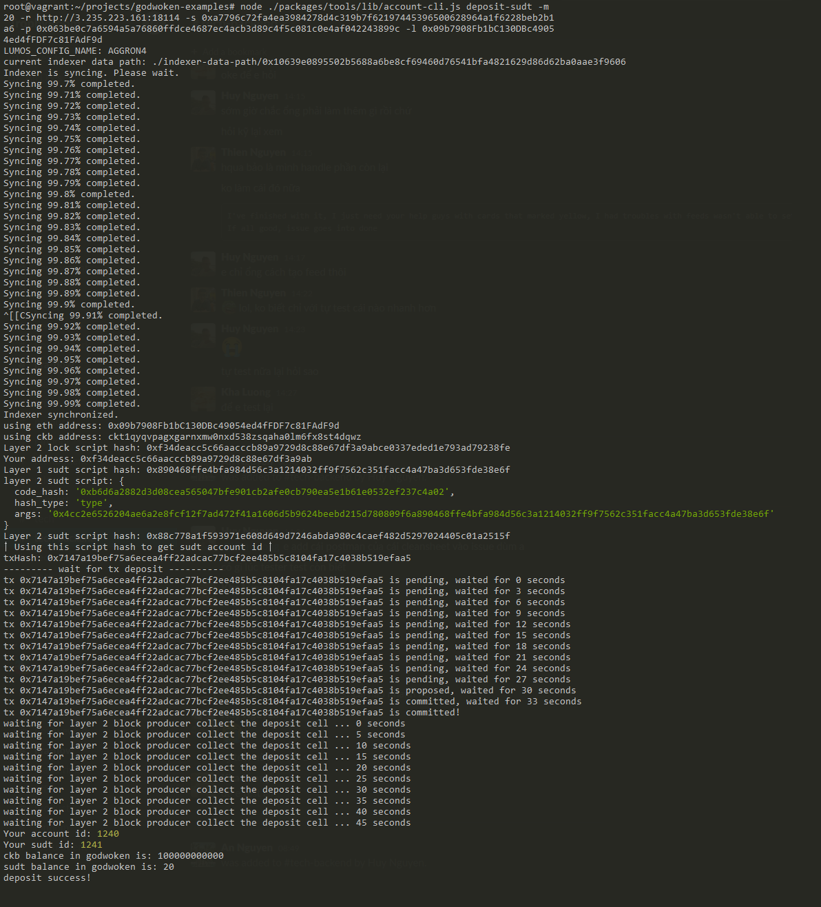

### Link to testnet explorer.

   https://explorer.nervos.org/aggron/address/ckt1qyqvpagxgarnxmw0nxd538zsqaha0lm6fx8st4dqwz

### A screenshot of the console output
   

### A link to transaction id as console output.

   https://explorer.nervos.org/aggron/transaction/0x602174e374a1f127b937bd98d30e7da58bc6033ae9bd8a37ba832888d196239c

### Deposit output to layer 2

   
   
### The SUDT ID from the console output

   `1241`
