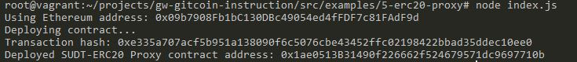
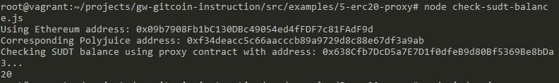

### Deployed contract output
   

### ERC20 Proxy contract address

   `0x1ae0513B31490f226662f524679571dc9697710b`

### A screenshot of the console output immediately after checking your SUDT balance.

   

### The Ethereum address that was checked

   `0x09b7908Fb1bC130DBc49054ed4fFDF7c81FAdF9d`

